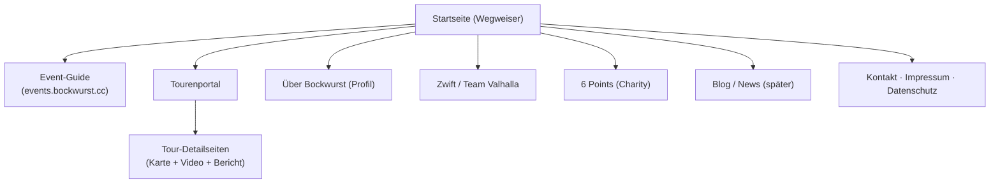

# bockwurst.cc – Inhalts- & Strukturkonzept (Entwurf v1)

> Stand: 23.06.2026 · Entwurf zum Drüberschauen & Ändern. Kein Technik-Dokument.
> Annahmen: Hauptzielgruppe = **Event-Suchende** · Startseite = **Wegweiser zu allen Säulen** · Stil angelehnt an den bestehenden Event-Guide.

## Worum geht's
bockwurst.cc ist die Marken-Plattform „Stefans Rennrad Welt". Die Startseite leitet Besucher schnell zum Richtigen; der **Event-Guide** ist der wichtigste Nutzwert, das **Tourenportal** und das Persönliche machen die Marke aus.

## Sitemap (Seitenbaum)

## Hauptmenü (Navigation)
**Events · Touren · Über mich · Zwift · 6 Points** · (Blog) — „Events" am prominentesten. Fußzeile: Kontakt, Impressum, Datenschutz, Social-Links. Sprachumschalter DE/EN.

## Seiten im Detail

| Seite | Zweck | Inhalt (Bausteine) | Hauptaktion |
|-------|-------|--------------------|-------------|
| **Startseite** | Erster Eindruck + Wegweiser | Marken-Hero (Claim), großer Block **„Events in deiner Nähe finden"**, Teaser „Neuestes Video/Tour", Kacheln zu Touren / Zwift / 6 Points / Über mich, kurzer Über-mich-Anriss | „Zum Event-Guide" |
| **Event-Guide** | Der Nutzwert: Events finden | Kurze Einleitung + Absprung zur bestehenden App `events.bockwurst.cc` | „Events suchen" |
| **Tourenportal (Übersicht)** | Touren entdecken | Raster aller Touren (Bild, Titel, Region, Distanz), Filter nach Region/Distanz | „Tour ansehen" |
| **Tour-Detailseite** | Eine Tour erleben | Streckenkarte, YouTube-Video, Bericht/Text, Eckdaten (Distanz, Höhenmeter, Zeit), optional GPX-Download | „Video ansehen" / „Strecke nachfahren" |
| **Über Bockwurst** | Wer dahintersteckt | Foto, Geschichte (20 Jahre), Rennrad Chemnitz, Zwift/Team Valhalla, Social-Links | „Folgen" (YouTube/Strava) |
| **Zwift / Team Valhalla** | Zwift-Community | Was ist Zwift, „Setup für Zwift-Rennen", Team Valhalla, Renntermine | „Mitfahren / Beitreten" |
| **6 Points (Charity)** | Fürs Charity-Event gewinnen | Was ist 6 Points, warum mitmachen, dein Engagement als Markenbotschafter | „Jetzt mitmachen" |
| **Blog / News** (später) | Reichweite & SEO | Artikel rund um Rennrad, Touren, Events | „Lesen" |
| **Kontakt / Recht** | Pflicht + Erreichbarkeit | Kontaktmöglichkeit, Impressum, Datenschutz | „Schreib mir" |

## Wie die Säulen auf Seiten abbilden
- Säule **Marke & Hauptseite** → Startseite + „Über Bockwurst"
- Säule **Tourenportal** → Tourenportal-Übersicht + Tour-Detailseiten
- Säule **Event Guide** → Event-Guide-Seite (Absprung zur App)
- Säule **Content/Community** → Zwift/Team Valhalla + 6 Points
- Säule **Reichweite** → Blog/News + Social/Newsletter (Fußzeile)

## Offene Produktentscheidungen (für dich)
1. **Event-Guide auf bockwurst.cc**: nur verlinken (eigene App bleibt unter events.bockwurst.cc) oder eingebettet anzeigen? *(Empfehlung: verlinken – sauberer.)*
2. **Tourenportal-Start**: mit allen 90+ Touren starten oder erst eine **kuratierte Auswahl** (z. B. 10 Highlights)? *(Empfehlung: kuratiert starten.)*
3. **Blog/News**: ab Start oder erst später? *(Empfehlung: später.)*
4. **Sprachen**: DE zuerst, EN ab Start oder nachziehen? *(Empfehlung: DE zuerst, EN nachziehen.)*
5. **Startseiten-Schwerpunkt**: Soll „Events" wirklich der größte Block sein, oder gleichberechtigt neben Touren?

---

## v2 – Entscheidungen & Vertiefung (23.06.2026)

### Getroffene Entscheidungen
1. **Event Guide → perspektivisch nativ in TYPO3** (als Extension/Plugin): wiederverwendbare Bausteine statt nur Verlinkung. Z. B. interaktiver Startseiten-Teaser „5 aktuellste Events + Absprung", volle Such-/Listenansicht, native Event-Detailseiten.
2. **Tour-Detailseite** wird zuerst ausgearbeitet (eigener Design-Brief).
3. **Blog/News**: erst später.
4. **Sprachen**: DE-Start, **EN gleich mit** (DeepL bezahlbar; Inhalte einmalig übersetzt).
5. **Startseite: Touren-Schwerpunkt** + Marken-Content (Rennrad-Tipps/Equipment/20-Jahre-Erfahrung), YouTube Shorts, **6-Points-Markenbotschafter-Teaser prominent**, Profil-Anriss – plus der Event-Teaser aus (1).

### Ziel-Architektur Event Guide (phasiert)
- **Phase A (kurzfristig, kleiner Aufwand):** Event-Guide bleibt eigene App unter `events.bockwurst.cc`. Auf bockwurst.cc nur ein **Teaser** (5 aktuellste Events aus den bestehenden `data/*.json`) + Absprung. Schnell, kein Umbau.
- **Phase B (Ziel):** Event-Guide als **TYPO3-Extension** `bockwurst_events` mit wiederverwendbaren Content-Elementen (Teaser, Such-/Listen-Plugin, native Detailseiten). Der Scraper füttert TYPO3. Vorteil: eine Plattform, SEO-fähige Detailseiten, überall einsetzbare Bausteine. Aufwand höher → später.

### Startseite – Blöcke (Reihenfolge)
1. **Hero** – Marke „Stefans Rennrad Welt" + aktuelles Highlight (neueste Tour/Video)
2. **Touren-Highlights** (Schwerpunkt) – kuratiertes Raster der besten Touren
3. **6 Points Charity** – prominenter Markenbotschafter-Banner (immer sichtbar)
4. **Event-Teaser** – „5 aktuellste Events in deiner Nähe" (interaktiv) + Absprung zum Guide
5. **YouTube Shorts** – Leiste mit aktuellen Shorts
6. **Über Bockwurst** – Profil-Anriss (Foto + 1–2 Sätze + Link)
7. *(später)* **Tipps & Erfahrungen** – Blog-Teaser (Equipment, 20 Jahre Rennrad)

### Tour-Detailseite – Bausteine (Basis für den Design-Brief)
- **Kopf:** Titel, Region/Startort, Tour-Typ (Rennrad/Gravel), Schwierigkeit, Saison/Datum
- **Eckdaten aus Strava:** Distanz (km), Höhenmeter (hm), Dauer, Ø-Tempo (Watt optional) – Kachelreihe
- **Interaktive Streckenkarte** (Polyline) **+ Höhenprofil**
- **YouTube-Video** (consent-gated)
- **Beschreibung & Fazit** (Fließtext + „Mein Fazit"-Box)
- **Rating** (z. B. Landschaft / Anspruch / Straßenqualität, oder Gesamt-Rating)
- **GPX-Download** + „Strecke nachfahren" (Komoot/Strava-Link) + Teilen
- **Vernetzung (wichtig):** „Events in dieser Region" (Absprung Event-Guide gefiltert), „Ähnliche Touren", ggf. „Zwift-Pendant", Link „Über Bockwurst"/Kanal abonnieren
- **Meine Ideen extra:** Höhenprofil, Ø-Tempo, Highlights/POIs entlang der Strecke (Pässe, Cafés), Saison-/Verkehrshinweis, Foto-Galerie, Tour-Serie/Tags, *(später)* Kommentare/Feedback
