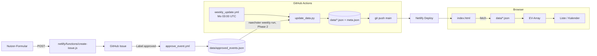

# Bockwurst Sport Events – Technische Dokumentation

> **Stand:** 22.06.2026 · **Repo:** https://github.com/stefangriessmann/sport-events
> Diese Datei ist die maßgebliche technische Referenz. Bei Architektur-, Workflow- oder
> Schema-Änderungen wird sie im selben Commit mitgepflegt (siehe [Wartung](#14-wartung-dieser-doku)).

---

## 1. Überblick

Bockwurst Sport Events ist ein werbefreier Event-Guide für **Rennrad, Triathlon, Schwimmen und Laufen in Deutschland**. Die Anwendung ist eine einzelne statische `index.html` ohne Build-Schritt und ohne Framework. Die Eventdaten liegen getrennt in `data/*.json` und werden zur Laufzeit per `fetch` im Browser geladen. Das Hosting läuft über Netlify, das bei jedem Push auf `main` oder `staging` automatisch deployt. Die Eventdaten aktualisiert ein wöchentlicher Cronjob als GitHub Action – ein manuelles Deployment ist dafür nicht nötig.

| | |
|---|---|
| **Live** | https://bockwurst-events.netlify.app (kanonisch: `/event-guide`) |
| **Staging** | https://staging--bockwurst-events.netlify.app |
| **Wunsch-Domain** | bockwurst.cc (noch nicht verknüpft) |
| **Hosting** | Netlify-Projekt `bockwurst-events` |
| **Eventbestand** | Rad 652 · Triathlon 296 · Laufen 218 · Schwimmen 10 (Stand 21.06.2026, siehe `data/meta.json`) |

### Architektur-Prinzip

Zwei Belange sind bewusst getrennt:

- **Design/Markup** liegt fest in `index.html` und ändert sich nur durch einen Entwickler-Commit.
- **Eventdaten** liegen in `data/*.json` und werden vom Cronjob aktualisiert.

Dadurch bleibt `index.html` klein (~87 KB statt früher ~4 MB mit eingebetteten Daten), und ein Daten-Update überschreibt nie das Design. Diese Trennung ist die zentrale Lehre aus einem früheren Vorfall, bei dem ein Daten-Umbau das Design zurückgesetzt hat.

---

## 2. Datenfluss



---

## 3. Repository-Struktur

```
sport-events/
├── index.html                     # Die App (Relaunch-Design, lädt Daten per fetch)
├── netlify.toml                   # Routing/Rewrites + Functions-Verzeichnis
├── og-image.png                   # OpenGraph-Bild – dient auch als YouTube-Kachel-Vorschau
├── requirements.txt               # Python-Abhängigkeiten der Scraper (requests, beautifulsoup4, lxml)
├── assets/
│   ├── img-e8513056.jpg           # Hintergrundbild der 6Points-Promo-Kachel
│   └── fonts/                     # 12 selbst gehostete woff2-Schriften (kein Google Fonts)
├── data/                          # Eventdaten + Caches (vom Cronjob gepflegt)
│   ├── radsport-de.json           # Radsport-Events
│   ├── triathlon-de.json          # Triathlon-Events
│   ├── laufen-de.json             # Lauf-Events (inkl. Mammutmärsche)
│   ├── swim-de.json               # Schwimm-Events (manuell gepflegt)
│   ├── meta.json                  # Stand-Datum + Eventzahlen pro Sportart
│   ├── plz_map.json               # PLZ → [lat, lon] für den Umkreisfilter
│   ├── approved_events.json       # Manuell freigegebene Einreichungen
│   ├── geocache.json              # Geocoding-Cache (PLZ/Ort → lat/lon)
│   └── startort_cache.json        # Cache für Triathlon-Startorte
├── scripts/
│   ├── update_data.py             # AKTUELLER Orchestrator: Scraper → data/*.json
│   ├── build_plz_map.py           # Baut data/plz_map.json
│   ├── approve_event.py           # Parst freigegebenes Issue → approved_events.json
│   ├── notify_resend.py           # Ergebnis-Mail via Resend (für CI)
│   ├── update_snapshots.py        # ALTLAST: altes Modell, schreibt in index.html (siehe §12)
│   └── scrapers/                  # Ein Scraper pro Quelle, jeweils fetch(year) -> list[dict]
│       ├── de_radnet.py           # rad-net.de
│       ├── de_radsport_events.py  # radsport-events.de
│       ├── de_triathlonde.py      # triathlondeutschland.de
│       ├── de_laufen.py           # laufen.run
│       ├── de_mammutmarsch.py     # Mammutmärsche (art: "Marsch")
│       ├── de_dtu.py              # DTU – vorbereitet, nicht in SOURCES aktiv
│       └── _geocode.py            # PLZ/Ort → lat/lon mit Cache + Nominatim-Fallback
├── netlify/functions/
│   └── create-issue.js            # Proxy: Formular-POST → GitHub-Issue
├── tests/
│   └── bockwurst.spec.js          # 76 Playwright-Tests gegen die deployte URL
├── .github/workflows/
│   ├── weekly_update.yml          # Wöchentliches Daten-Scraping (aktiv, maßgeblich)
│   ├── e2e.yml                    # Playwright-Tests nach jedem Deploy
│   ├── approve_event.yml          # Event-Freigabe per Label
│   └── monthly-update.yml         # ALTLAST: ruft update_snapshots.py (siehe §12)
├── CLAUDE.md                      # Projektkontext für Agenten – VERALTET (siehe §12)
└── docs/
    └── TECHNISCHE-DOKUMENTATION.md # diese Datei
```

---

## 4. Frontend (`index.html`)

Die Datei ist selbst-enthalten: HTML, CSS (`<style>`) und JavaScript stecken in einer Datei. Die Schriften liegen als `@font-face` mit lokalen woff2-Dateien unter `assets/fonts/` – bewusst ohne Google Fonts, damit das Versprechen „kein Tracking, keine Cookies" hält.

### 4.1 Daten laden (`boot()`)

Beim Laden ruft `boot()` die vier Datendateien parallel per `fetch` ab, bildet jeden Datensatz auf das interne `EV`-Schema ab und füllt `PLZ_MAP` aus `data/plz_map.json`. Erst danach läuft `render()`.

```js
const SRC = [
  ['/data/radsport-de.json', 'rad'],
  ['/data/triathlon-de.json', 'tri'],
  ['/data/laufen-de.json',   'lauf'],
  ['/data/swim-de.json',     'swim'],
];
// pro Datensatz: TYPE_SPORT[art] = sport  (Zuordnung dynamisch je Quelldatei)
//               EV.push({ art, datum: date_iso, titel, ort, plz, strecken, verein, lv, url, lat, lon })
```

Die Sport-Zuordnung `TYPE_SPORT[art] = sport` wird **dynamisch je Quelldatei** gesetzt. Dadurch landen auch neue oder unbekannte `art`-Werte automatisch in der richtigen Sportart – zum Beispiel die Mammutmärsche mit `art: "Marsch"`, die sonst fälschlich als Radsport gälten.

### 4.2 Internes Event-Schema (`EV`)

Das Frontend rechnet mit einem schlankeren Objekt als die Datendateien:

| Feld | Quelle in `data/*.json` | Beschreibung |
|------|--------------------------|--------------|
| `art` | `art` | Eventtyp (RTF, Gravelride, Triathlon, Marsch, …) |
| `datum` | **`date_iso`** | ISO-Datum `JJJJ-MM-TT` (zum Sortieren und Filtern) |
| `titel` | `titel` | Eventname |
| `ort` | `ort` | Austragungsort |
| `plz` | `plz` | Postleitzahl |
| `strecken` | `strecken` | Streckenlängen, per `/` getrennt |
| `verein` | `verein` | Veranstalter |
| `lv` | `lv` | Landesverband/Bundesland |
| `url` | `url` | Detailseite |
| `lat`, `lon` | `lat`, `lon` | Koordinaten für den Umkreisfilter |

Wichtig: Das Feld `datum` im `EV`-Objekt enthält das **ISO-Datum** (`date_iso` der Datei), nicht die Anzeige-Schreibweise `So, 21.06.2026`.

### 4.3 Filter und Ansichten

- **Sportleiste** (`#sportbar`): Alle / Radsport / Triathlon / Schwimmen / Laufen.
- **Zeitraum** (`#zeitraum`): Alle Termine, Dieses Wochenende, Diesen Monat, Nächste 30 Tage, eigener Zeitraum (`#dfrom`/`#dto`).
- **Umkreis** (`#plz` + `#radius`): PLZ-Eingabe plus Radius (ganz DE / 50 / 100 / 150 / 250 km). Die PLZ wird zuerst gegen `PLZ_MAP` (aus `data/plz_map.json`) aufgelöst, dann gegen einen `localStorage`-Cache, zuletzt live gegen die Nominatim-API. Die Distanz berechnet eine Haversine-Funktion.
- **Event-Typ** (`#typeMenu`): Unterarten der gewählten Sportart per Checkbox.
- **Ansichten** (`#viewtabs`): Liste (`#listView`, Karten, Seitengröße 8 + „Mehr laden") und Kalender (`#calView`, nach Monaten gruppiert).

### 4.4 Weitere Frontend-Bestandteile

- **Zweisprachigkeit** (DE/EN) über `data-de`/`data-en`-Attribute, umgeschaltet per `tl()`.
- **SEO**: `schema.org`-`ItemList` wird zur Laufzeit aus den kommenden Events erzeugt; OpenGraph- und Twitter-Meta sind gesetzt; kanonische URL ist `/event-guide`.
- **Promo-Kacheln**: 6Points-Mallorca (Bild aus `assets/img-e8513056.jpg`, Early-Bird-Countdown) und „Neuestes Video" (YouTube-Kachel; Vorschaubild ist `og-image.png`).
- **Vorschlags-Formular**: siehe [§8](#8-event-einreichung-und-freigabe).

---

## 5. Hosting und Routing (Netlify)

`netlify.toml`:

```toml
[functions]
  directory = "netlify/functions"

# /event-guide liefert die App (Rewrite, kein Redirect)
[[redirects]]
  from = "/event-guide"
  to   = "/index.html"
  status = 200

# Wurzel leitet auf /event-guide (kanonische URL)
[[redirects]]
  from = "/"
  to   = "/event-guide"
  status = 301
  force = true
```

Aufruf von `/` führt also per 301 auf `/event-guide`, das per Rewrite (Status 200) die `index.html` ausliefert. Netlify deployt automatisch bei jedem Push: `main` → Live, `staging` → Staging-Subdomain.

---

## 6. Deployment-Modell

- **Kein Build-Schritt.** Netlify serviert die statischen Dateien direkt.
- **`index.html` ist ein fest committetes Artefakt.** Nur ein Entwickler-Commit ändert das Design. Kein Scraping-Job darf `index.html` neu erzeugen (siehe Altlast in §12).
- **Branches:** `main` (Live) und `staging`. Üblicher Ablauf: erst auf `staging` pushen, Staging und E2E prüfen, dann nach `main` mergen.

Standard-Deploy aus einer lokalen Arbeitskopie mit Push-Recht:

```bash
git checkout staging && git pull
# Änderungen committen
git push origin staging          # → Netlify baut Staging, e2e.yml testet Staging
# wenn grün:
git checkout main && git merge --ff-only staging && git push origin main
```

---

## 7. Daten-Pipeline (`scripts/update_data.py`)

`update_data.py` ist der **maßgebliche** Orchestrator. Er schreibt ausschließlich nach `data/*.json` und fasst `index.html` nicht an.

**Quellen (`SOURCES`):**

| Zieldatei | Scraper | Sportart |
|-----------|---------|----------|
| `radsport-de.json` | `de_radnet` + `de_radsport_events` | rad |
| `triathlon-de.json` | `de_triathlonde` | tri |
| `laufen-de.json` | `de_laufen` + `de_mammutmarsch` | lauf |
| `swim-de.json` | — (manuell gepflegt) | swim |

**Phasen:**

1. **Scrapen** – je Quelle die Scraper laufen lassen und Treffer einsammeln (`dedup` entfernt Duplikate).
2. **Freigaben einmischen** – Einträge aus `data/approved_events.json` werden je nach Sportart der passenden Datei hinzugefügt (inkl. Geocoding fehlender Koordinaten).
3. **Schwellenwert-Schutz und Ausgabe** – pro Datei greift ein `MIN_EVENTS`-Guard (`radsport-de.json` 50, `triathlon-de.json` 20, `laufen-de.json` 20, `swim-de.json` 0). Liefert ein Scraper weniger als das Minimum, bleibt die bestehende Datei erhalten. Das fängt etwa ein rad-net-Rate-Limiting ab, das gelegentlich 0 Events zurückgibt.
4. **Schwimmen aufräumen** – aus `swim-de.json` werden vergangene Events entfernt.
5. **`meta.json` schreiben** – Stand-Datum und Eventzahlen pro Sportart.

Aufrufe:

```bash
python3 scripts/update_data.py             # voller Lauf (scrapen + schreiben)
python3 scripts/update_data.py --no-scrape  # nur approved_events.json einmischen
python3 scripts/update_data.py --dry-run    # nichts schreiben
```

### PLZ-Karte (`scripts/build_plz_map.py`)

Erzeugt `data/plz_map.json` (`PLZ → [lat, lon]`, ~8200 Einträge). Bezugsquellen in dieser Reihenfolge: GeoNames-`DE.zip`, `suche-postleitzahl.org`, ein Zauberware-Datensatz auf GitHub, danach lokale Caches. Der Browser lädt die Datei nur, wenn eine PLZ eingegeben wird.

### Scraper-Eigenheiten

- **`de_radnet`**: Rate-Limiting bei schnellen Folgeaufrufen, kann 0 Events liefern → `MIN_EVENTS`-Guard.
- **`de_radsport_events`**: filtert virtuelle Zwift-Events (`virtuell` im Ort).
- **`de_triathlonde`**: braucht Detailseiten-Scraping für Koordinaten.
- **`de_mammutmarsch`**: liefert `art: "Marsch"` – im Frontend über die dynamische `TYPE_SPORT`-Zuordnung als Laufen geführt.
- **Geocoding** (`_geocode.py`): PLZ → `geocache.json` → Nominatim → Ort → Nominatim → Landesverband-Zentroid als letzter Fallback.

---

## 8. Event-Einreichung und Freigabe

1. Der Nutzer füllt das Formular „Event vorschlagen" aus (`openModal` in `index.html`).
2. Beim Absenden schickt das Frontend einen POST an `/.netlify/functions/create-issue` mit `{ title, body }`. Der Body steht im `**Schlüssel:** Wert`-Format, das `approve_event.py` parst (`Sport`, `Typ`, `Name`, `Datum`, `Ort`, `PLZ`, `Strecke`, `Link`).
3. `create-issue.js` legt damit über die GitHub-API ein **Issue** an. Der Token dafür ist die Netlify-Env-Var `GITHUB_ISSUES_TOKEN` (niemals im Quellcode).
4. Stefan prüft das Issue und vergibt das Label **`approved`**.
5. `approve_event.yml` löst aus, ruft `approve_event.py` auf, hängt das Event an `data/approved_events.json` und schließt das Issue.

> **Sichtbarkeit:** `approve_event.yml` ruft `update_data.py --no-scrape` auf und committet die aktualisierten `data/*.json`. Ein freigegebenes Event ist damit nach dem Workflow-Lauf und dem folgenden Netlify-Deploy sofort live.

---

## 9. Continuous Integration (GitHub Actions)

| Workflow | Auslöser | Zweck | Status |
|----------|----------|-------|--------|
| `weekly_update.yml` | Cron Mo 03:00 UTC + manuell | Scrapen → `data/*.json` committen, Ergebnis-Mail | **aktiv, maßgeblich** |
| `e2e.yml` | Push auf `main`/`staging` + manuell | Playwright-Tests gegen die deployte URL, Ergebnis-Mail | aktiv |
| `approve_event.yml` | Issue erhält Label `approved` | Freigabe verarbeiten (`update_data.py --no-scrape`) | aktiv |
| `monthly-update.yml` | Cron 1. des Monats 05:00 UTC + manuell | Voll-Refresh via `update_data.py --year` | aktiv (weitgehend redundant zu weekly) |

**Voraussetzung:** Unter **Settings → Actions → General → Workflow permissions** muss **„Read and write permissions"** gesetzt sein. Sonst scheitert der `git push` der schreibenden Workflows mit einem 403 (dieser Fall ist bereits aufgetreten und behoben).

`e2e.yml` ermittelt die Ziel-URL je Branch (`main` → Live, sonst Staging), wartet auf den Netlify-Deploy und führt dann `tests/bockwurst.spec.js` aus. Beide schreibenden Workflows verschicken am Ende per `notify_resend.py` eine Ergebnis-Mail (siehe §10).

---

## 10. Benachrichtigungen

**Formular-Einreichungen** laufen über GitHub-Issue-Benachrichtigungen, ohne eigenen Mailversand: Da jede Einreichung ein Issue erzeugt, mailt GitHub den Repo-Owner. Voraussetzung: web.de ist als verifizierte, primäre Benachrichtigungsadresse hinterlegt und das Repo wird beobachtet (**Watch → Custom → Issues**).

**Cron- und Test-Ergebnisse** verschickt `scripts/notify_resend.py` über **Resend** (HTTP-API, kein SMTP). Das Skript überspringt sich ohne Fehler, solange kein Schlüssel gesetzt ist.

- Secret: `RESEND_API_KEY` (GitHub → Settings → Secrets and variables → Actions).
- Absender: derzeit `onboarding@resend.dev`. Sobald die Domain `bockwurst.cc` in Resend verifiziert ist, lässt sich der Absender über die Env-Var `NOTIFY_FROM` (z. B. `noreply@bockwurst.cc`) umstellen.
- Empfänger: `stefan.griessmann@web.de` (überschreibbar per `NOTIFY_TO`).

Daneben sind in Netlify die Variablen `NETLIFY_EMAILS_DIRECTORY` und `NETLIFY_EMAILS_SECRET` gesetzt – die Netlify-Email-Integration steht also bereit, falls künftig eine eigene Mail direkt aus einer Netlify-Funktion gewünscht ist.

---

## 11. Tests (Playwright)

`tests/bockwurst.spec.js` enthält **76 Tests** gegen die deployte Seite, gruppiert in zehn Blöcke: Seitenaufruf, Daten-Vollständigkeit, Sport-Filter und Konsistenz, Event-Details, PLZ-Distanzfilter, Reset, Datumsfilter, Event-Typ-Filter, Ansichten und Pagination.

Die Tests sprechen den Relaunch-DOM an (`#sportbar .sport`, `#listView .ev`, `#plz`, `#radius`, `#stats .stat .v`, `#viewtabs`, `#typeMenu`, `#loadmore`). Sie warten zunächst, bis das globale `EV`-Array befüllt ist.

Lokal ausführen:

```bash
npm install -D @playwright/test
npx playwright install chromium
BASE_URL=https://staging--bockwurst-events.netlify.app npx playwright test tests/bockwurst.spec.js
```

Ohne `BASE_URL` läuft die Suite gegen die Live-URL.

---

## 12. Bekannte Altlasten und Risiken

> Dieser Abschnitt ist der wichtigste für die Wartung. Hier stehen die Stolperfallen, die schon einmal zu Regressionen geführt haben oder noch latent sind.

1. **`update_snapshots.py` ist abgelöst (Stand 22.06.2026).** `approve_event.yml` und `monthly-update.yml` rufen jetzt `update_data.py` auf und committen `data/*.json` statt `index.html`. Das frühere Regressionsrisiko – ein Scraping-Job erzeugt `index.html` neu und überschreibt das Design – ist damit beseitigt. `scripts/update_snapshots.py` wird von keinem Workflow mehr verwendet und kann bei Gelegenheit entfernt werden.
2. **`index.html` darf nie von einem Scraping-Job neu erzeugt werden.** Genau das hat früher das Relaunch-Design überschrieben. Nur `update_data.py` (Daten) und gezielte Entwickler-Commits (Design) sind erlaubt.
3. **Geleakte Tokens.** In früheren `HANDOVER.md`/`STATUS.md` standen GitHub-Tokens im Klartext. Diese sind zu widerrufen/rotieren. Tokens gehören ausschließlich in Netlify-Env-Vars bzw. GitHub-Secrets, nie in den Quellcode.
4. **`CLAUDE.md`** ist auf die aktuelle Architektur aktualisiert und verweist als schlanker Agenten-Einstieg auf diese Doku.
5. **Landesverband-Fallback ist kein Bug.** Events ohne geocodierbare Adresse bekommen das Zentroid ihres Bundeslands als Koordinaten. Das ist gewollt.

---

## 13. Troubleshooting

| Symptom | Ursache | Lösung |
|---------|---------|--------|
| Altes Design erscheint live | `index.html` wurde durch einen Job/Commit überschrieben | Relaunch-`index.html` wiederherstellen; sicherstellen, dass nur `update_data.py` läuft (§12) |
| `weekly_update`/`approve_event` schlägt im Push-Schritt fehl (403) | Workflow permissions auf „Read-only" | Settings → Actions → General → „Read and write permissions" |
| Formular zeigt „Senden fehlgeschlagen" | `GITHUB_ISSUES_TOKEN` in Netlify fehlt/ungültig | Gültiges Token (issues:write) als Netlify-Env-Var setzen |
| Schriften wirken „nackt", Felder ungestylt | woff2-Schriften fehlen | `assets/fonts/` muss vollständig deployt sein (kein Google Fonts!) |
| Ein Scraper liefert 0 Events | Rate-Limiting (v. a. rad-net) | `MIN_EVENTS`-Guard behält den alten Stand; Lauf später wiederholen |
| E2E-Test rot direkt nach Deploy | Netlify war beim Testlauf noch nicht fertig | `e2e.yml` wartet bereits; ggf. Wartezeit erhöhen oder Lauf erneut starten |
| Keine Cron-/Test-Mail | `RESEND_API_KEY` fehlt | Secret in den Actions-Secrets setzen |
| Freigegebenes Event erscheint nicht | Sichtbarkeit hängt am `update_data.py`-Lauf | siehe §8/§12; bis zur Umstellung greift der nächste wöchentliche Lauf |

---

## 14. Wartung dieser Doku

Diese Datei wird im **selben Commit** wie die jeweilige Änderung mitgepflegt. Konkret aktualisieren bei:

- neuer Quelle/Scraper → §3, §7
- geändertem Daten- oder `EV`-Schema → §4.2, §7
- neuem oder geändertem Workflow → §9
- geänderten Filtern, Ansichten oder DOM-IDs → §4.3, §11 (und die Tests selbst)
- erledigter Altlast aus §12 → Eintrag entfernen/anpassen
- Routing-/Hosting-Änderungen → §5, §6

Das Stand-Datum im Kopf der Datei bei jeder Pflege mitziehen. Die Eventzahlen in §1 sind ein Momentwert; die maßgebliche Quelle ist stets `data/meta.json`.

---

## 15. Nützliche URLs

| URL | Zweck |
|-----|-------|
| https://bockwurst-events.netlify.app/event-guide | Live-Seite |
| https://staging--bockwurst-events.netlify.app/event-guide | Staging |
| https://github.com/stefangriessmann/sport-events | Repository |
| https://github.com/stefangriessmann/sport-events/issues | Event-Einreichungen |
| https://github.com/stefangriessmann/sport-events/actions | CI-Läufe (Scraping, Tests) |
| https://app.netlify.com | Netlify-Dashboard |
